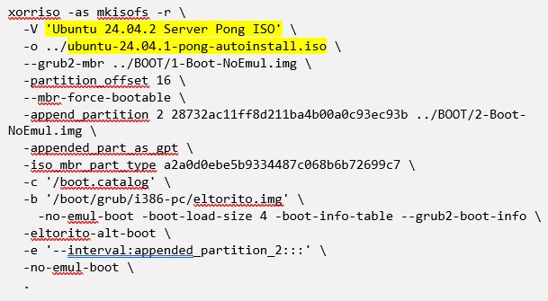

# Creation of ISO Build Guide

### Description
The `iso-create.sh` found in `/setup/autoinstall-iso` creates a custom ISO from the provided user-data and
meta-data files based off of the open-source Ubuntu Server release (default 24.04.2 release). This shell
script is heavily based on
[this tutorial found online](https://www.pugetsystems.com/labs/hpc/ubuntu-22-04-server-autoinstall-iso/#:~:text=Introduction,work%20and%20trial%20and%20error.).

### Things to Note
1. If you are having trouble running the script it may need certain permissions to run properly. Run the
command `chmod +x iso-create.sh` to make the script executable.

2. There is one variable in the script called `$ISO_DIRECTORY` that specifies where the iso-creation will be
and can be changed to different names. If you try to create a new ISO and the specified directory already
esists, **it will overwrite it**.

### Steps Followed in `iso-create.sh`
**These are all automatically done in the shell script. You don't need to follow these steps manually to create the iso unless you really want to.**

1. Prerequisites
- download additional packages to assist in later creation

2. Set up build environment
- move out of the autoinstall-iso directory and create new iso directory in the root of the repo to store
the iso files
- move into the iso repository and download Ubuntu Server from `https://releases.ubuntu.com/`. The wget link
will be of form: 
`https://releases.ubuntu.com/<CODENAME>/ubuntu-<VERSION_NUMBER>-live-server-amd64.iso`

3. Unpack files and partition images from source ISO
- unpack files and move them into a directory called source files
- delete the open-source server ISO to save space as it is no longer needed. We have all the source files
extracted from it
- in the source files directory, there is a directory named `'[BOOT]'` which contains the master boot record and
efi (UEFI) partition images from the ISO which will be used when the modified ISO is created. No reason to leave
the raw image files on the new ISO so move them out of the way into a directory called `BOOT`

4. Edit the ISO `grub.cfg` file
- these are the menu entries specified on startup as bootable options
- the first menu entry is changed to "Pong AutoInstall Ubuntu Server" and the boot path is specified to the
user-data file (`/cdrom/server`)

5. Copy the server folder found in `/setup/autoinstall` into the source-files directory of the custom ISO
- the files in the server folder are the `user-data`, `meta-data`, and `dev-post-install.sh`

6. Run the command to generate the new custom Ubuntu Server ISO which outputs the new ISO one directory above `source-files`
- you can change the -V and the -o file names as shown highlighted below but everything else must remain the same in this command 

