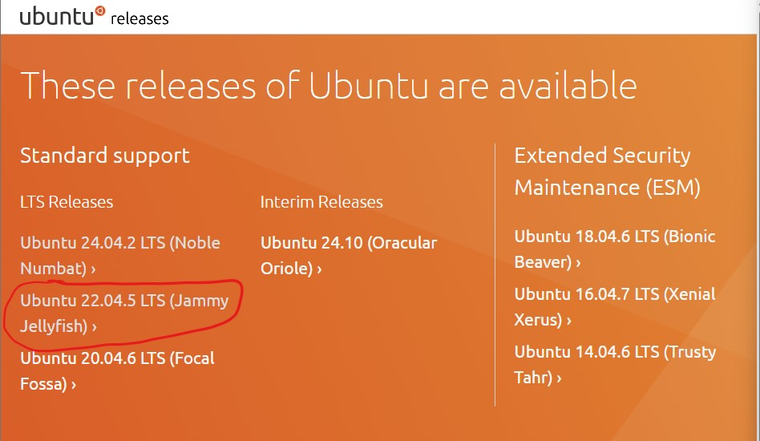
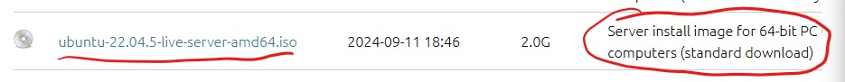

# Updating the ISO to a new Ubuntu Server Release Guide

### Description
This guide walks through the steps to edit the `iso-create.sh` to download a different release of Ubuntu Server.
This is probably the hardest guide to follow so I provided as many pictures as I can to make the update process
easier.

### Things to Note
1. The autoinstall system was built by default to run on Ubuntu 24.04.2. Changing to a different release of Ubuntu
Server could cause dependency issues and errors as backward compatability has not been tested.

### Steps to Change Releases
Each line specified is found in `iso-create.sh`.
1. Line 35: Update the `wget` command to the different release link. Ubuntu Server releases can be found
[here](https://releases.ubuntu.com/).
- Click on the release you want and make node of the **codename** and scroll down until you see the list of various
file releases.
- Find the Server install image for 64-bit PC (AMD64) computers and note the **image name**
- Next, combine the different names you noted to create the link `wget` will use. The link name is of the
form  `https://releases.ubuntu.com/<CODENAME>/ubuntu-<VERSION_NUMBER>-live-server-amd64.iso`

2. Line 38: Update the unpack files command to specify the correct server install **image name** which was found in Step 1.
- the new command would look like:  `7z -y x <IMAGE_NAME> -osource-files`

3. Line 40: Update the remove command to remove the correct file name. This is the same **image name** found in Step 1.
- the new command would look like:  `rm <IMAGE_NAME>`

#### Full Example of the Steps Above
1. Line 35
- Lets say I want to download the Ubuntu Server 22.04.5 Release (Jammy Jellyfish). I go to the releases website
mentioned above and click on this release 

- I make note of the **codename** which is `jammy` in this case

- I then scroll down to find the list of various file release until I find the server **image name** for
`64-bit PIC (AMD64) computers` 

- I make note of the **version number** which is `22.04.5` and the **image name** which is
`ubuntu-22.04.5-live-server-amd64.iso`

- Finally I combine to create the link name which is 
`https://releases.ubuntu.com/jammy/ubuntu-22.04.5-live-server-amd64.iso`

- So my wget command would be 
`wget https://releases.ubuntu.com/jammy/ubuntu-22.04.5-live-server-amd64.iso`

2. Line 38
- We already know the **image name** from the previous step so my unpack command becomes 
`7z -y x ubuntu-22.04.5-live-server-amd64.iso -osource-files`

3. Line 40
- We use the same **image name** to update the remove command to save space so it becomes 
rm ubuntu-22.04.5-live-server-amd64.iso`

