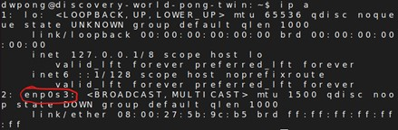
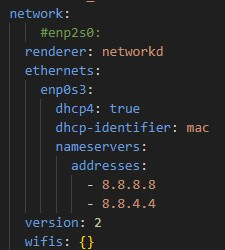

# AutoInstall Implementation Overview for MSOE and Rockwell Automation AI Pong

### Description
The current status of the AutoInstall implementation for the AI Pong exhibit is a single, custom ISO built
off of the free source Ubuntu Server 24.04.1 ISO. This ISO adds in additional user-data and meta-data files
to create a custom ISO that clones the Discovery-World-Pong-MSOE repository and run the post-install script
to set up the system and depth sensor camera for the AI Pong Exhibit.

### Overview
This document provides a brief overview of the system and points you in the right direction depending on what
you want to do with the system. At the end of this overview there is a list of known errors and notable changes
that are good to keep in mind as well.

### Setup Guidance
This section provides you with some guidance for which guide to locate next depending on what you're trying
to do with the system.

##### List of Guides
- **overview.md**: Where you are currently located. This guide provides a brief overview of the entire
implementation.

- **iso-create.md**: This guide is for *creating* a fresh ISO image from scratch. It tells you which shell
script should be run to do this and then walks through what the creation process looks like. The guide also
mentions what can be changed by the user in the shell script to produce a different result.

- **iso-change.md**: This guide is for *updating* a previously existing iso image to apply any changes that
were made in the iso directory. It tells you which shell script should be run to do this and then waks through
what the shell script does to update the existing iso image.

- **iso-update-release.md**: This guide is for updating the `iso-create.sh` to a different open source release
of Ubuntu Server. The guide walks trough what to change in the shell script to achieve a different release.

- **vm-setup.md**: This guide is for setting up a Virtual Machine using OracleBox to run the iso. It walks
through all the necessary steps to ensure the Virtual Machine runs properly without error. It also walks through
how to add a new iso to a pre-existing setup VM.

### Changes to Note
For the `user-data` file found in `/setup/autoinstall-iso/server`

1. In the late commands section, **you must chose which post install script you want to run on the system once
it finishes downloading**. By default, the post install script that runs automatically is the one found on the
main branch of the git repository. For testing purposes, there is a development script that can be modified
separate from the repo that helps with development. This is the second option that by default is commented out.
Feel free to chose whichever one you need, but **only uncomment one at a time**.

For the post install commands to install the required packages for the depth sensor camera:

1. These are currently found in the `dev-post-install.sh` located at `/setup/autoinstall-iso/server` as they
haven't been approved into the main branch yet. When adding the Intel RealSense repository key the Jammy update
is the most recent update that is supported by Intel RealSense as of March 2025. The system by default runs off
of the Noble update which is one version above the Jammy update which is why Jammy must be hardcoded into the
repository link as Noble is not yet supported. Eventually, this should change to be a variable that grabs the
codename for the current version and downloads the correct repo. The depth sensor camera still runs fine on the
newer version even when using Jammy instead of Noble. The line I am referring to is: 
`sudo echo "deb [signed-by=/etc/apt/keyrings/librealsense.pgp] https://librealsense.intel.com/Debian/apt-repo jammy main" | sudo tee /etc/apt/sources.list.d/librealsense.list`

For the system as a whole:

1. The system by default runs off of Ubuntu Server 24.04.2. The system itself has not been fully tested for backwards
compatibility with earlier versions of Ubuntu Server. This will have to be tested.

2. When making changes in a ISO directory, keep in mind that **these changes will only be applied to that specific iso directory**.
If you decide to create a new iso and you want those changes you applied you will need to update the files in
the `/setup/autoinstall-iso/server` directory to reflect the changes in newly generated iso's.

3. The default username is `dwpong` and the default password is `pong`. These can be changed in
`/setup/autoinstall-iso/server/user-data` under the identity -> password section. You will have to generate a
sha-256 of the new password to replace the old one.

### Common Errors
Network '____' cannot be found or identified, etc.

- The user-data file is configured to work with my network (enp0s3) which is a common network name but means that
potentially your network could be different from mine.
- If this error occurs, open a shell in the VM or the native OS by pressing Enter and type the command `ip a`. Locate the network name. It
should be the 2nd network. 

- Next, go to wsl and navigate to `/<ISO_DIRECTORY>/source-files/server` and open the `user-data` file.
- Find this section and change the name enpos3 to the name of your network. Then follow the steps in `iso-change.md` to generate a
new iso and then follow `vm-setup.md` to switch the VM to this new ISO. 
